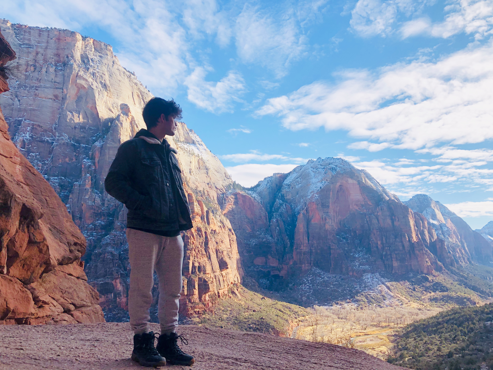

# Hello!! 
#### My name is Laurence D'Ercole and I am a 3rd year Computer Science Major and Cognitive Science Minor at UCSD

# About me
Some hobbies of mine are playing _soccer_, goind **surfing** and playing with my ~~cat~~ dog!!
Here is a picture of him being [awesome](images/rocky.JPG)

My favorite quote by ***Master Oogway***:
> There are no accidents

My favorite command is `sudo su -`

I love using [StackOverflow](https://stackoverflow.com/) when I am unsure about something I'm working on

My top 3 favorite programming languages are:
1. Python
2. C++
3. Java

Some things I hope to achieve by the end of this school year:
- Learn about databases
- Learn about networks
- Learn more about cybersecurity
- Develop meaningful projects

My tasks for this week:
- [x] Attend all my classes
- [x] Get an early start on homework
- [ ] Update my Resume

To go back to the top click [here](#hello)
